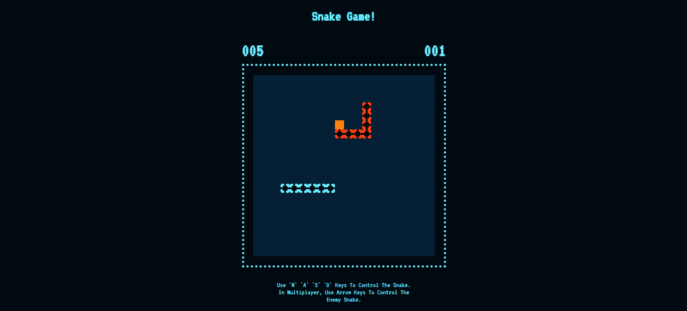

# Snake Game Javascript!

A simple Javascript snake game. Created while attending MLH Global Hack Week Games 2024.

In singleplayer mode use the 'W' 'A' 'S' 'D' keys on the keyboard to control the player/blue snake to eat food (orange square). The more food you eat without dying the higher your score. You will die if you hit the enemy snake or you hit yourself. In multiplayer mode another player can use the arrow keys on the keyboard to control the enemy snake to attack the blue snake.

### Play on the Web!
https://snake-game-ten-black.vercel.app/

### Challenges we ran into
There are lots of tutorials online teaching people how to make Javascript snake games. The added challenge for me was to create an autonomous enemy snake in singleplayer mode. The hardest part was to get multiplayer mode working to and make sure the event listener passed the event to the right functions.

### Accomplishments that we're proud of
First Javascript snake game I ever made!

### What we learned
Using Switch and Case in Javascript and you need multiple event listeners for each function it is passing events into.

### What's next for Javascript Snake Game!
Refining some of the graphics: When food gets eaten the blue snake will have a little bulge. Adding some animation for when the snake eats food. Adding sound effects to the game. Refining the gameplay with the enemy snake: Enemy snake can't move into itself, enemy snake can steal the blue snake's food.